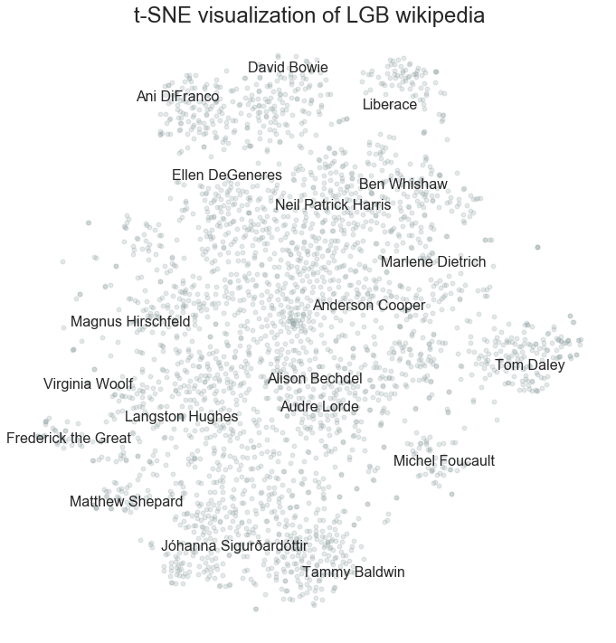
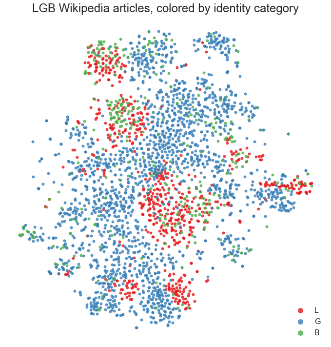
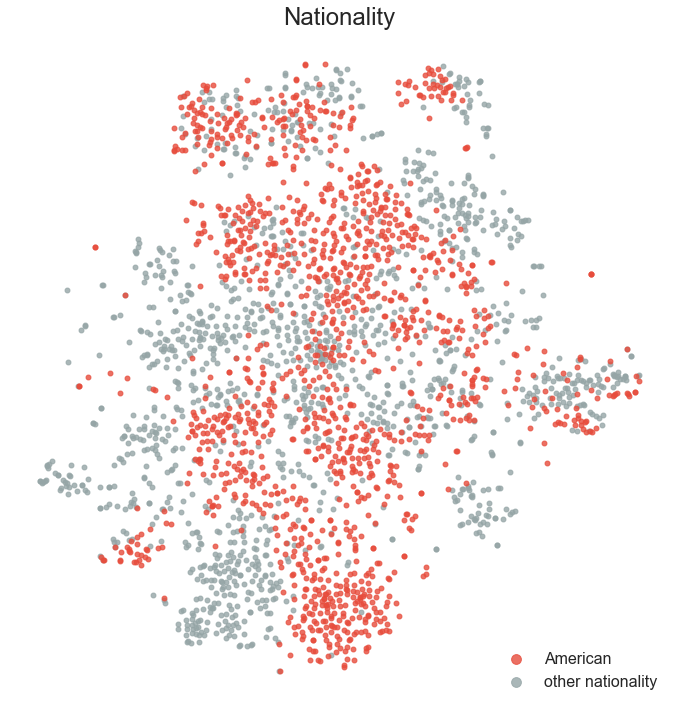
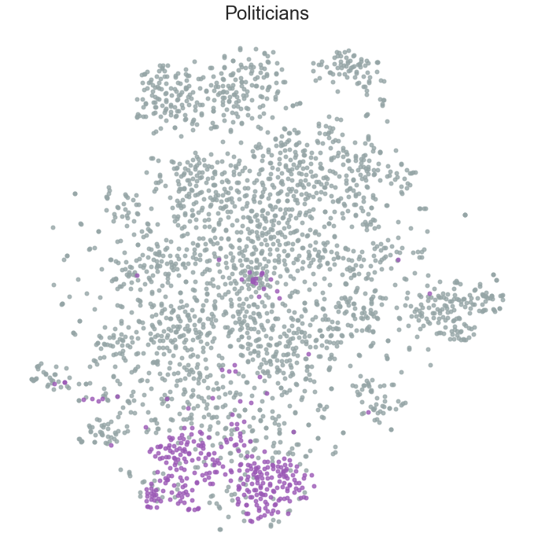

\setlength\parindent{0.5cm}
\setlength{\parskip}{0em}
\linespread{1.6}\selectfont
\def\UrlBreaks{\do\/\do-\do\.}

# Introduction

As sexual minorities and a marginalized social group, LGB people have advocated for themselves politically, and an important part of this activism has been *visibility* in the public sphere. As the media frenzy that ensues every time a new celebrity or other public figure "comes out" publicly might indicate, it still matters socially and politically to be an LGB person in the public sphere. From this, we could surmise that for out LGB individuals, their sexuality is a key, salient part of their public persona.

I propose to investigate this using a public, crowdsourced data source, namely Wikipedia. How salient are different LGB identities to the biographies of notable public figures, as reflected in their Wikipedia entries? How distinctly are those identities represented from each other, and what other factors play a role in distinguishing these texts?

A priori, it is not obvious what aspects of biographical articles will emerge as most salient in their texts, or what approach should be used to incorporate textual information. I consider a range of possibilities, and find that the document embedding approach captures some of the same basic intuitions seen in my simplest topic model, but conveys considerably more information. The supervised-learning element fits into the larger research domain of inferring demographic information from text (e.g. Bamman et al 2014), though I primarily use it as a means of evaluating my approaches.

The context in which this work matters is one of representation, visibility, and bias. Research has shown that Wikipedia has substantial gender bias in content (Wagner et al 2015), and in contributors (Hargittai and Shaw 2015). It has important cultural and geographic biases as well (Holloway et al 2005, Callahan and Herring 2011). Not only are all of these known biases reflected in my data, but there may be unique biases in Wikipedia content affecting LGB individuals specifically. It is reasonable to suppose that part of what motivates users to contribute to a list of LGB individuals is a desire to redress or counteract bias and lack of representation. This is a potentially fruitful area to investigate, because text-as-data methods have already begun to show promise by adding to our documentation of bias and representation. For instance, word embeddings have been used to quantify gender and ethnic stereotypes over time in other corpora such as Google Books (Garg et al., 2017).

Wikipedia is a unique platform, and the kinds of texts it contains may not generalize to other sources. But Wikipedia matters in itself, in part because reach of Wikipedia in the public sphere of the internet is extensive. A Google search for any public figure, gay or straight, will return metadata sourced directly from Wikipedia. Recently, the CEO of YouTube Susan Wojcicki announced that YouTube would link to Wikipedia entries to counteract conspiracy theories.[^wikimedia_statement] Given Wikipedia's role in search and the diffusion of information, itself a source of bias and discrimination (e.g. Noble 2018), it is worthwhile to examine how it portrays LGB people specifically.

[^wikimedia_statement]: She did not inform the Wikimedia Foundation of this initiative in advance. https://twitter.com/Wikimedia/status/973995260056625153

# Data

The data for this project are drawn from Wikipedia's List of lesbian, gay or bisexual people (https://en.wikipedia.org/wiki/List_of_gay,_lesbian_or_bisexual_people), which is the most extensive list out of a list of lists of LGBT people (https://en.wikipedia.org/wiki/Lists_of_LGBT_people). There are separate lists of transgender people, people with non-binary gender identities, and pansexual people. There is active discussion about whether or not to break the list of bisexual people out from the list of lesbian and gay people. A unique feature of the LGB list is that it takes the form of a table with metadata about the people listed. The other lists of LGBT people do not share this format, and would require separate web-scraping code to collect, which is why I have not yet attempted to do so.

The list is dynamic and, by definition, incomplete. As with the rest of Wikipedia, it is crowdsourced from volunteers, and each article must meet standards for *notability*. To be included, a person must be openly LGB or documented as such from *reliable sources*.[^wikipedia_meta] As of March 2018, the list has 2898 entries. Of these, all but two contain valid links to 2882 unique articles.

[^wikipedia_meta]: Wikipedia publishes guidelines and definitions for [notability](https://en.wikipedia.org/wiki/Wikipedia:Notability) and [reliability](https://en.wikipedia.org/wiki/Wikipedia:Identifying_reliable_sources).

Each entry in the list is labeled as L (lesbian), B (bisexual), or G (gay). This is the primary piece of metadata that I am interested in, and it is distributed as follows.

\linespread{1}\selectfont

: Identity categories

Label      N
-----   ----
L        659
G       1883
B        340

\linespread{1.6}\selectfont

A gender bias in coverage or inclusion is readily apparent: two-thirds are gay men and only a quarter are lesbians. The fact that a mere 12% are bisexual individuals---despite the fact that bisexual identity is increasingly prevalent (England et al 2016)---is indicative of a phenomenon called bi invisibility or bi erasure.[^bierasure]

[^bierasure]: GLAAD on bi erasure: https://www.glaad.org/bisexual/bierasure. Bi individuals may actually experience greater discrimination in domains like the labor market relative to gay men and lesbians (Mize 2016).

The introduction to the list notes that it has a Eurocentric or Western bias. It does not, however, indicate that *half* of those included are Americans. Many of the other most common nationalities are also Anglophone countries.

\linespread{1}\selectfont

: Top 20 nationalities

Nationality         N            Nationality         N
-------------    ----    ----    -------------    ----
American         1445            Dutch              25
English           293            Italian            22
Canadian          241            Norwegian          19
German            105            New Zealander      18
British            92            Russian            17
Australian         86            Mexican            15
French             70            Belgian            14
Swedish            40            Finnish            12
Scottish           29            South African      12
Irish              26            Spanish            12

\linespread{1.6}\selectfont

The final piece of metadata I will use is a short text field describing what these individuals are notable for. An individual could be listed as notable for more than one reason. For instance, Janet Aalfs, the first person alphabetically on the list, is described as both a martial artist and poet. I merge this field across individuals, filter stopwords, and summarize the most commonly occurring words that remain.

\linespread{1}\selectfont

: 20 most common words, reason for notability (stopwords removed)

Notable as        N                    Notable as        N
-----------     ---    ------------    -----------     ---
writer          432                    film             91
actor           381                    journalist       82
politician      343                    television       80
musician        247                    rights           79
activist        171                    rock             79
director        137                    composer         78
singer          111                    lgbt             77
author          110                    playwright       75
poet            103                    pop              71
artist           91                    comedian         71

\linespread{1.6}\selectfont

The most common reasons for notability span writing, politics, media, entertainment, and the arts. The most apparent absence here is of anything related to *sports*. This is because the terms used to refer to sportspeople are heterogenous (player, athlete, Olympic, skater, swimmer, etc.); they begin to appear further down on the list.

I use all of these metadata categories to interpret and evaluate my text modeling strategies below.

# Methods

The tools I used are as follows: the beautifulsoup and wikipedia Python packages for data collection, gensim for topic modeling and word/document embeddings, scikit-learn for supervised learning and t-SNE, and seaborn and bokeh for visualization.

## Topic modeling

I briefly explored latent semantic indexing and latent dirichlet allocation as strategies for unsupervised learning about my corpus. I used a range of small values for the number of topics, *K*, from 2 to 20. At a variety of *K* values, I had challenges with duplicative-seeming topics, but new topics also appeared at larger *K* values. With *K* values too large, topics became overly specific, including things like proper names. Using count vectors produced topics that were far more substantively interpretable than tf-idf weighted, though I use the latter below for supervised classification. Overall, I did not find the topic modeling results to be especially informative, and I focused the majority of the project on alternative approaches.

## Document embeddings using Doc2Vec

Initially, I trained Word2Vec models on my corpus and compared the resulting word embeddings to GloVe (Pennington et al 2014). GloVe is a set of vectors pre-trained on a dump of the entirety of English Wikipedia in 2014, plus the Gigaword 5 corpus, with a vocabulary of 400K words. I did this to validate that I had sufficient data to produce useful embeddings.

Having done this, I moved onto the more substantively interesting task of training a Doc2Vec model on the same data. I again preprocessed and tokenized each document (using a simple, default preprocessor from gensim), and additionally *tagged* it with the title of the article as an identifier.

In terms of model parameters, I used the default feature vector size of 100 and window between predicted word and context of 10. Increasing the minimum count, which is the frequency threshold for including a word, from 1 to 5 reduces the vocabulary size to one third of the original, from 98916 to 30377 words; I tested both for Word2Vec but used a minimum count of 1 only for Doc2Vec. I trained the models for 10 epochs, and did not attempt to manually adjust the learning rate. The Doc2Vec version I used was Paragraph Vector - Distributed Memory (PV-DM), which trains both document vectors and word vectors (the alternative, DBOW, is much slower if you choose to train document and word vectors simultaneously).[^notebook]

[^notebook]: This Jupyter notebook explains and compares the different versions of Doc2Vec:  https://github.com/RaRe-Technologies/gensim/blob/develop/docs/notebooks/doc2vec-IMDB.ipynb

The face validity of these models can be qualitatively assessed using similarity queries, measured using cosine similarity. The words and documents that are most similar to each other should correspond to some sort of intuition or sense, even if they could not be predicted in advance.  

I use t-SNE visualizations to get a broader, more holistic picture of how the model has described the data set. T-SNE is a form of dimensionality reduction, similar to PCA, but it produces more distinctive clusters, at the cost of being both more computationally expensive and stochastic (Wattenberg et al 2016). Dai et al (2015) visualize the entirety of Wikipedia using t-SNE, and produce meaningful semantic clusters. Their approach and interpretation is discussed further in Olah 2015.

I tested two random states to make sure that the same clusters appeared in similar orientations toward each other, but I did not test different hyperparameters. I used the default perplexity, 30, and the default number of iterations, 1000.

## Classification: td-idf and document embeddings

To evaluate whether my text representations are effective, I built a classifier to predict from them whether a given person is lesbian, gay, or bi (L, G, B). I used a sparse, tf-idf weighted term-document matrix and the length-100 vector representations of the document embeddings, in separate models.[^example] In both cases, I used an SVM classifier with hinge loss. I also tested logistic regression, with highly similar results, but slightly lower performance. I used an identical train-test split (75%-25%).

[^example]: Qiu 2015 is an excellent example of using the results of doc2vec for prediction.

# Results

## Topic models

The most subjectively satisfying topic model had 10 topics. With fewer than that, music, politics, and books predominated. With more, topics started to include proper names and other overly specific words. This model includes several topics about music, one about politics, and others about arts, writing, movies, and so on. These generally conform to the results of my t-SNE visualizations, shown below. However, some topics come across as mixed---the fifth topic combines words related to music and sports, and I suspect that this is because words like "record" and "play" / "player" (stemmed "plai-") can have both meanings. Models that take into account word contexts, like Doc2Vec, should perform better in this regard.

\linespread{1}\selectfont

: **Topic model.** Count vectors, *K* = 10.

topic                | top words
---------------------|----------------------------------------------------------------
contemporary music 1 | "music", "album", "song", "releas", "record", "new", "perform"
classical music      | "music", "compos", "work", "world", "piano", "time", "year"
contemporary music 2 | "album", "song", "releas", "record", "music", "new", "perform"
politics             | "gai", "elect", "new", "state", "right", "univers", "member"
music / sports       | "plai", "year", "record", "team", "perform", "new", "album"
writing              | "work", "book", "new", "publish", "univers", "isbn", "write"
unknown              | "work", "wild", "year", "life", "time", "french", "pari"
murder / crime       | "new", "murder", "year", "state", "court", "later", "smith"
visual art           | "art", "work", "new", "york", "museum", "galleri", "photograph"
movies               | "film", "award", "appear", "plai", "new", "star", "seri"

\linespread{1.6}\selectfont

## Doc2Vec

### Individual similarity

It is possible to train a reasonable Word2Vec model on my data set, as evidenced by the fact that a word like "man" shows a great deal of overlap in terms of most similar words between the model based purely on the data set and a well-regarded pre-trained model like GloVe. The differences, too, are intriguing: GloVe has picked up on function words, while the LGB model instead has a set of words related to physical appearance. While systematically investigating these differences could be a worthwhile project, I did not choose to do so. (The model does not do very well at analogy tasks, like *queen = king - man + woman*.)

I illustrate document similarity with three examples, though I investigated others as well. For the individuals that I queried, the Doc2Vec model determines that articles about recognizably related individuals are the most similar. For Foucault, it lists French writers and intellectuals; for Senator Baldwin, US politicians; and for Langston Hughes, LGB African-Americans, with the most similar being other figures from the Harlem Renaissance.

\linespread{1}\selectfont

: **Word2Vec.** Most similar words to 'man'.

GloVe                LGB word2vec
------------         -------------
woman, 0.69          person, 0.56
person, 0.64         boy, 0.55
boy, 0.62            men, 0.52
he, 0.59             handsome, 0.52
men, 0.58            woman, 0.47
himself, 0.58        himself, 0.47
one, 0.57            swoon, 0.45
another, 0.57        attractive, 0.44
who, 0.57            bloke, 0.43
him, 0.56            hero, 0.43

: **Doc2Vec.** Most similar articles to ...

| Michel Foucault    | Tammy Baldwin  | Langston Hughes      |
|--------------------|----------------|----------------------|
| Roland Barthes     | Kyrsten Sinema | Claude McKay         |
| Marcel Proust      | Patricia Todd  | Countee Cullen       |
| Jean-Paul Aron     | Jim Kolbe      | Wallace Thurman      |
| André Gide         | Heather Mizeur | James Baldwin        |
| Marquis de Sade    | Carole Migden  | Richard Bruce Nugent |
| Guy Hocquenghem    | Mark Pocan     | Bayard Rustin        |
| Witold Gombrowicz  | Kate Brown     | Essex Hemphill       |
| Cyrano de Bergerac | Jared Polis    | Alain LeRoy Locke    |
| Simone de Beauvoir | Karen Clark    | Walt Whitman         |
| Elías Nandino      | Bonnie Dumanis | Alice Dunbar Nelson  |

\linespread{1.6}\selectfont

### t-SNE

On the following pages, I display multiple figures highlighting different aspects of a two-dimensional rendering of the 100-dimensional document vectors. What emerges is a striking picture of global and local structure, which I briefly describe. Note that the directions themselves are meaningless, but I describe the relations between clusters spatially for convenience. Other iterations of t-SNE show the same clusters but with different rotations.

Musicians, singers, and composers (like David Bowie) stand out at the top, while politicians (like US Senator Tammy Baldwin) cluster at the bottom. On the far right are sportspeople (like Tom Daley, a British Olympic diver), while the left has a smaller group of historical figures (like Frederick the Great). Actors, directors, and comedians fall closer to the center under the musicians, while authors and writers take up much of the space in the middle. Smaller thematic clusters like murder victims (like Matthew Shepard, victim of a hate crime in Wyoming) and French intellectuals (like Michel Foucault) can be seen around the edges.[^crime]

[^crime]: The murder-victims area *also* includes serial killers and other individuals known for criminal behavior.

From this spatial organization, it can be determined that the most salient characteristic shaping the global structure of these documents is what the individuals are notable for. However, as Figures 2-4 illustrate, different characteristics become salient on a local level. This interplay between global and local characteristics helps compactly describe the overall structure of the corpus.

Figure 2 shows that, within substantive domains of notability, lesbians cluster with lesbians and gay men with gay men. Bisexual individuals are interspersed among each. Figure 3 shows that Americans tend to separate somewhat from other nationalities. Other nationalities, such as the French, Germans, British, or Canadians, tend to form small clusters of their own. (This can be seen by exploring the interactive version of Figure 2, which shows more metadata about points when they are hovered over.) Finally, Figure 4 breaks out a particular domain, politicians, to more clearly illustrate the shape of that cluster.

Taken together, these three figures suggest the following sort of taxonomy:

- politicians
    - American
        - gay men
        - lesbians
    - non-American
        - gay men
        - lesbians

Within a substantive domain, people are grouped by nationality, and then by gender/sexuality. This strikes me as elegant, but not necessarily obvious in advance. While the relationship between document vectors and the original texts is not transparent or straightforward, I speculate that it relates to the degree to which each of these characteristics features in the texts. Notability is the criterion for being the subject of a Wikipedia article in the first place, while sexuality may be mentioned only incidentally.









## Classification results

Overall, text is a powerful way to classify Wikipedia articles by identity category, but with some very important caveats. The SVM models based on tf-idf and on doc2vec have high, nearly identical accuracies (0.861 vs 0.862), but investigating the similarities and differences between them is instructive. Unsurprisingly, they each do best for the most common group, gay men, with precisions and recalls of .90 or higher. They do quite well for lesbians, but with different precision-recall tradeoffs. However, they do poorly for the least-represented group, bisexual individuals, which is a matter for concern. Through this kind of differential performance, a machine-learning model like this one can reinforce biases (as Buolamwini and Gebru 2018 have documented for facial recognition).

The tf-idf model is substantially worse in this regard. It contributes to bi erasure and invisibility by classifying only 3 individuals in the entire test set as bisexual. I suspected that this model was picking up features related to *gender* rather than *sexuality*, and I confirmed this by looking at the misclassified bisexual individuals in the test set. All of the bi individuals predicted to be lesbian are women, and all but one predicted to be gay are men. By contrast, while the dense document-vector-based model does not classify bisexual individuals particularly well, it does much better---not only is it actually able to classify more than 3 individuals as bi, more than half those it classifies as such actually are.

\linespread{1}\selectfont

### tf-idf results

```
precision and recall:

             precision    recall  f1-score   support

          B       1.00      0.03      0.07        86
          G       0.90      0.98      0.94       474
          L       0.76      0.94      0.84       161

avg / total       0.88      0.86      0.81       721

confusion matrix:

      B   G   L
B [[  3  42  41]
G  [  0 466   8]
L  [  0   9 152]]
```

### doc2vec results

```
precision and recall:

             precision    recall  f1-score   support

          B       0.57      0.28      0.37        86
          G       0.90      0.97      0.93       474
          L       0.82      0.86      0.84       161

avg / total       0.84      0.86      0.85       721

confusion matrix:

      B   G    L
B [[ 24  38  24]
G  [  7 460   7]
L  [ 11  12 138]]
```

\linespread{1.6}\selectfont

# Conclusions and future directions

Despite the fact that these public figures have been chosen for inclusion on a list of LGB people, sexual identity is not the most salient feature of their biographies. Nevertheless, it is distinctive and distinguishing, within the context of notability and nationality.

If I were to choose a single approach for characterizing this data set, I would choose Doc2Vec and its dense vector representations over topic modeling and bag-of-words approaches based on sparse representations. I found that it is not necessary to have millions of documents to achieve useful results (and, I would argue, meaningful ones).

It would bolster this project to look beyond a narrow range of sexual and gender identities---trans and non-binary individuals, but also cisgender heterosexual public figures. For the former, this means dealing with complex and overlapping identities. The challenge for the latter is to come up with a sampling strategy---as a normative, unmarked group, heterosexuals have no Wikipedia list or category.

I anticipate that word and document embeddings will see increasing use in social science research. The Doc2Vec approach could be applied to *extract* labels or categories from a set of documents in an unsupervised manner, in cases where a crowdsourced human resource like the list of LGB people on Wikipedia has not manually done so already.

Increasingly, machine-learning researchers have contemplated the interpretability of models based on neural networks (Olah 2015, Wattenberg et al 2016, Olah et al 2018). For instance, leveraging the similarities between words and documents might begin to explain *why* documents are clustered together. Moving beyond thinking about these models as uninterpretable black boxes and instead using them as tools for explanation will make them more relevant to social science research.

# References

\setlength\parindent{-0.5cm}
\setlength\leftskip{0.5cm}

Buolamwini, Joy and Timnit Gebru. 2018. “Gender Shades: Intersectional Accuracy Disparities in Commercial Gender Classification.” Pp. 77–91 in Conference on Fairness, Accountability and Transparency.

Callahan, Ewa S. and Susan C. Herring. 2011. “Cultural Bias in Wikipedia Content on Famous Persons.” Journal of the American Society for Information Science and Technology 62(10):1899–1915.

Dai, Andrew M., Christopher Olah, and Quoc V. Le. 2015. “Document Embedding with Paragraph Vectors.” ArXiv:1507.07998 [Cs]. Retrieved March 15, 2018 (http://arxiv.org/abs/1507.07998).

England, Paula, Emma Mishel, and Monica L. Caudillo. 2016. “Increases in Sex with Same-Sex Partners and Bisexual Identity Across Cohorts of Women (but Not Men).” Sociological Science 3:951–70.

Hargittai, Eszter and Aaron Shaw. 2015. “Mind the Skills Gap: The Role of Internet Know-How and Gender in Differentiated Contributions to Wikipedia.” Information, Communication & Society 18(4):424–42.

Holloway, Todd, Miran Bozicevic, and Katy Börner. 2005. “Analyzing and Visualizing the Semantic Coverage of Wikipedia and Its Authors.” ArXiv:Cs/0512085. Retrieved March 6, 2018 (http://arxiv.org/abs/cs/0512085).

Le, Quoc V. and Tomas Mikolov. 2014. “Distributed Representations of Sentences and Documents.” ArXiv:1405.4053 [Cs]. Retrieved March 9, 2018 (http://arxiv.org/abs/1405.4053).

Mize, Trenton D. 2016. “Sexual Orientation in the Labor Market.” American Sociological Review 0003122416674025.

Noble, Safiya Umoja. 2018. Algorithms of Oppression: How Search Engines Reinforce Racism. NYU Press.

Olah, Chris. 2015. “Visualizing Representations: Deep Learning and Human Beings.” Colah’s Blog. Retrieved March 15, 2018 (http://colah.github.io/posts/2015-01-Visualizing-Representations/).

Olah, Chris et al. 2018. “The Building Blocks of Interpretability.” Distill 3(3):e10.

Qiu, Linan. 2015. “Sentiment Analysis Using Doc2Vec.” Pandamonium. Retrieved March 15, 2018 (http://linanqiu.github.io/2015/10/07/word2vec-sentiment/).

Ruder, Sebastian. 2016. “On Word Embeddings - Part 3: The Secret Ingredients of Word2vec.” Sebastian Ruder. Retrieved March 15, 2018 (http://ruder.io/secret-word2vec/).

Wagner, Claudia, David Garcia, Mohsen Jadidi, and Markus Strohmaier. 2015. “It’s a Man’s Wikipedia? Assessing Gender Inequality in an Online Encyclopedia.” Pp. 454–463 in ICWSM.

Wattenberg, Martin, Fernanda Viégas, and Ian Johnson. 2016. “How to Use T-SNE Effectively.” Distill 1(10):e2.
